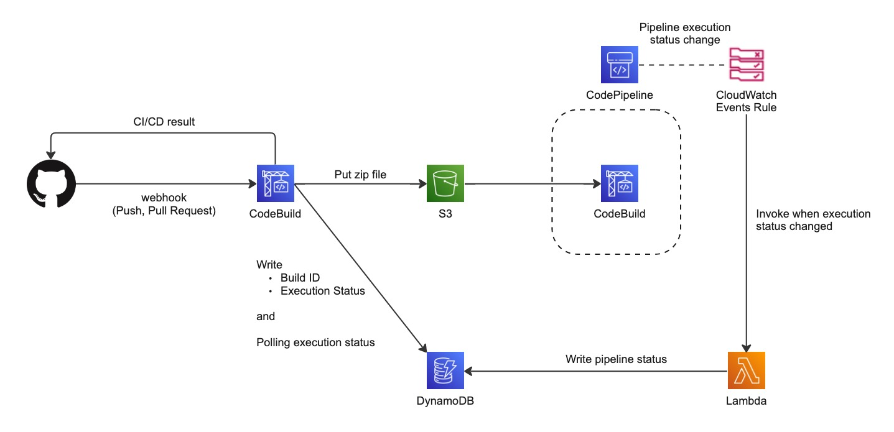

# code-pipeline-github-webhook

CodePipeline 単体では実現できない、不特定多数のブランチ (主に feature ブランチを想定) への Push をトリガーとしたワークフロー実行を行うサンプルです。

CloudFormation template を使って AWS リソースを定義しているため必要な環境をコマンド 1 つでデプロイ可能です。

このサンプルでは GitHub リポジトリの  main, develop ブランチ以外への Push 及び Pull Request をトリガーとして Pipeline が起動されます。Pipeline での処理に関しては例示のため Unit test のみになっていますが、必要に応じて処理を Pipeline の Stage に追加することでカスタマイズ可能です。

## 構成図



## AWS へのデプロイ

事前に下記の作業 3 つが必要です。

1. AWS CLI のインストール。詳細は下記の公式ドキュメント参照。

    https://docs.aws.amazon.com/ja_jp/cli/latest/userguide/getting-started-install.html

1. GitHub にて Personal access token を取得する。詳細は下記の公式ドキュメント参照。

    https://docs.aws.amazon.com/ja_jp/codebuild/latest/userguide/access-tokens.html

1. 上記で取得した token をデプロイコマンド実行前に AWS の Management Console で設定する

    1. CodeBuild の console を開き `Create build project` ボタンを押す
    1. Source provider のドロップダウンから `GitHub` を選択する
    1. `Connect with a GitHub personal access token` を選択し、`GitHub personal access token` の欄に GitHub から取得した Personal access token を入力し `Save token` ボタンを押す
    1. console 最下部の `cancel` ボタンを押して `Create build project` のウィザードを閉じる

1. `scripts/env.template` をコピーして `scripts/.env` ファイルを作成し、必要なパラメータを記載する

    | Parameter name | Description | Required |
    |--|--|--|
    | TEMPLATE_STORE_S3_BUCKET_NAME | CloudFormation template を格納する S3 バケット。<br />ここで指定した S3 に対してデプロイスクリプトが必要な template を動的にアップロードします。 | Yes |
    | GITHUB_REPOSITORY_URL | Pipeline をトリガーする GitHub リポジトリの URL | Yes |
    | AWS_PROFILE | AWS CLI 実行時に使用する AWS の Profile。<br />指定しない場合は default profile が使用されます。 | No |

上記の手順が完了後、この README と同じディレクトリ階層で下記コマンドを実行することで必要な環境が AWS 上にデプロイされます。

```
bash scripts/deploy-pipeline.sh
```

## 注意事項

- 今回使用している GitHub のリポジトリが Organization に属さないもののため Personal access token を発行して GitHub と CodeBuild を接続しています。Organization 内に作されたリポジトリの場合、OAuth により接続が可能な場合がありますので、皆様の環境に適した方法をご利用ください。

- このサンプルは GitHub Apps などを設定する必要がなく上記のコマンドを使って AWS リソースをデプロイするだけで使用可能になりますが、GitHub の Webhook により起動される CodeBuild の Container は Pipeline 処理が完了か timeout するまで起動し続けますので、ビルドやテストなどに時間がかかるアプリケーションの場合 CodeBuild の料金がかさむ可能性がありますのでご注意ください。

- CloudFormation stack の削除時に不要な S3 リソースが残らないように DeletionPolicy は設定しておりません。Pipeline 実行後は S3 内部にファイルが作成されておりますので stack の削除時に DELETE_FAILED 状態になりますが S3 内部のファイルを削除 (Object のすべての version を削除) してから再度 stack の削除を実行すると正常に削除されます。
